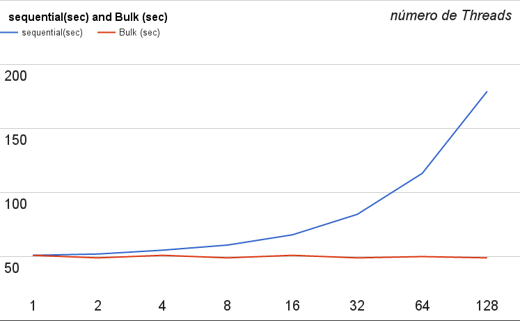

% Sistemas Distribuídos - Trabalho 3
% Grupo:  Marcos Seefelder, Pedro Eusébio; Professor: Daniel Ratton; 14/07/2016
% O código pode ser encontrado no repositório: [https://github.com/mseefelder/COS470-tp3](https://github.com/mseefelder/COS470-tp3)

# *Remote Procedure Calls*

## O problema:

O problema proposto se refere à implementação de um serviço de *Remote Procedure Calls* (RPC) que ofereça procedimentos para aplicar funções matemáticas sobre os elementos de um vetor.

## Soluções:

### Tecnologias e decisões de projeto:

Para esta tarefa optamos por desenvolver o código com a linguagem de programação **C++**, utilizando a biblioteca [*grpc[1]*](http://www.grpc.io/) (Google RPC) que por sua vez usa, por padrão, o mecanismo de [*protocol buffers[2]*](https://developers.google.com/protocol-buffers/) para a serialização de dados. Ambas são desenvolvidas pela Google e são de código aberto. Essa escolha se deu basicamente pela boa documentação disponível e simplicidade do código gerado.

Os serviços e a estrutura das mensagens são definidos em arquivos *.proto*, a partir do qual o **protocol buffer compiler** (*protoc*) gera definições de classes que descrevem as estruturas das mensagens assim como o mecanismo de base para a implementação do cliente e do servidor de RPCs. Os métodos para montar as mensagens, definir os valores dos campos e ler os mesmos são definidos por padrão. O trabalho principal envolve, portanto, definir uma estrutura adequada para o sistema e implementar tanto as chamadas quanto a execução das RPCs no cliente e servidor, respectivamente.

Buscamos desenvolver as chamadas no cliente de forma que as mesmas parecesse ao usuário como uma simples chamada de função. O padrão seguido é: `void f (double* v, size_t s);`, no qual a função `f()` recebe um ponteiro para `double` que deve indicar qual a primeira posição de memória a ser operada e um valor `s` que define quantas posições contíguas à primeira são operadas. A operação, do ponto de vista do usuário, ocorre *in-place* uma vez que fizemos de maneira similar à técnica de *pass by copy-restore*.

Decidimos implementar as três funções:
* ArrayInc: Adiciona uma unidade a todos os elementos do *array*;
* ArrayPow2: Aplica potência de 2 à todos os elementos do *array*;
* ArrayMultiplyBy: Multiplica todos os elementos do *array* por um parâmetro.

### Primera solução: Usando *streams*

A definição de um `rpc` no arquivo *.proto* tem como argumento um tipo de `message` e como retorno outro tipo de `message`. Opcionalmente, ao invés de utilizar apenas `message` nessas definições, podem-se utilizar uma `stream` de um determinado tipo de message. Abaixo um trecho com a definição de um serviço com uma `rpc` e a `message` utilizada pelo serviço:

```
service ArrayOperator {
	rpc ArrayPow2(stream Number) returns (stream NumberArray) {}
}

message Number {
	double value = 1
}
```

No caso da nossa primeira implementação, definimos todas as três funções recebendo e retornando *streams*, o que na prática significava que era criado um canal de leitura e escrita entre uma *thread* do cliente e outra do servidor (criada para atender à chamada) e cala uma delas lançava outra *thread* para ler e escrever em paralelo. Dessa maneira, em uma chamada os elementos do vetor pelos quais a *thread* do cliente era responsável eram passados e recebidos do servidor de RPC um por vez. Os valores retornados, por sua vez, substituiam os valores no *array* original.

O problema é que essa abordagem se mostrou muito ineficiente, provavelmente pelo fato de que para cada elemento haviam dois envios entre o cliente e o servidor (a chamada e o retorno) e o *overhead* gerado por isso tornava nosso código proibitivamente lento para a execução.

### Segunda solução: Usando *repeated*

Resolvemos então que uma solução mais eficiente seria empacotar um conjunto de elementos do vetor juntos em uma mensagem e usar isso como parâmetro e retorno das RPCs. No caso, isso é possível definindo os campos da `message` como `repeated`, fazendo com que a estrutura gerada para a mensagem tenha um vetor dinâmico de algum tipo (no nosso caso, double). Abaixo apresentamos o rpc que faria parte de um serviço e uma mensagem:

```
rpc ArrayPow2(NumberArray) returns (NumberArray) {}

message NumberArray {
	repeated double value = 1;
}
```

Em C++, adicionar um valor à uma `NumberArray`, ler seu tamanho e acessar seus valores é tão simples como chamar as funções `add_value`, `value_size` e `value` que são geradas pelo *protoc* a partir das definições no arquivo *.proto*.

O único problema com essa solução é que quando a parte do vetor que cabia a cada *thread* era muito grande, a biblioteca lançava um *warning* (e dependendo do tamanho um erro que encerrava a aplicação). Para contornar esse problema, criamos uma função que separa os vetores as chamadas de RPC em *chunks*, baseado em se o tamanho dos mesmos ultrapassa um limite fixo adequado. Fizemos isso de forma que a **função pública** visível ao usuário fosse apenas uma chamada (`void arrayPow2(double* vector, size_t vecSize)`, por exemplo), mas que por dentro poderia originar diversas chamadas de RPC, o que é decidido pela função `chunkify()`.

## Análise dos resultados:

O estudo de caso foi realizado em um computador com processador intel i7 4700MQ 2.40Ghz x 8, 8 Gbs de memória ram, rodando sistema operacional Ubuntu Linux 14.04 de 64 bits.

Podemos perceber abaixo que, na primeira implementação, para um pequeno número de *threads* o tempo de execução aumenta consideravelmente, tendo uma variação de 4 a 12 segundos no primeiro caso e de 55 a 180 segundos no segundo caso. Além disso, o menor tempo de execução esta diretamente relacionado ao número de *cores* do processador. Para valores maiores, o tempo tende a crescer de forma mais suave.

{ width=50% }\ { width=50% }

*Gráficos: Tempos para as operações num array de $10^6$ (esquerda) e $10^7$ (direita) elementos, com a primeira solução*

Já na implementação utilizando *repeated*, temos os gráficos abaixo. Nos eixos verticais, os tempos em segundos e nos horzontais, os números de *threads*: 

{ width=50% }\ { width=50% } 

{ width=50% }\

*Tempo médio de 10 execuções das operações `ArrayInc` (esquerda), `ArrayPow2` (direita) e `ArrayMultiplyBy` (embaixo) num vetor de $10^8$. Linhas de média superior e inferior obtidas através da soma e subtração da média com o desvio padrão.*

Pode-se analisar que essa implementação respeita o mesmo princípio da implementação anterior: com um número de *threads* próximo do número de *cores* o tempo de execução tende a diminuir e quando o número de *threads* ultrapassa o número de *cores*, ou é pequeno de forma a não aproveitar tanto paralelismo (casos de 1 e 2 *threads*), o tempo tende a aumentar.

Porém, o tempo de execução é consideravelmente menor, com 8 *threads* a implementação rodou a função `ArrayInc` para um *array de 10^8 elementos em apenas 2,17 segundos, já a implementação anterior, rodou para uma *array* de $10^7$ em 57 segundos. Comprovando assim, a melhora de desempenho da implementação.

# Exclusão Mútua Centralizada

## O problema:

O problema apresentado é a implementação do algoritmo de **Exclusão Mútua Centralizada** para o controle de escrita de diversos processos em um arquivo comum.

## Solução:

Para o desenvolvimento dessa tarefa, optamos por utilizar a linguagem de programação [**Lua[3]**](https://www.lua.org/) e apenas uma biblioteca para administrar *sockets* (*luasockets*). A escolha visava aproveitar a maior abstração para simplificar o código.

A aplicação foi implementada utilizando *sockets* com *User Datagram Protocol* (UDP), que escolhemos como alternativa ao TCP (*Transmission Control Protocol*) por ser mais leve e rápido. Uma desvantagem de seu uso é que o mesmo não é confiável e sabemos que em uma aplicação de exclusão mútua seria interessante garantir o tratamento de erros de envio. Como para essa aplicação em específico todas as mensagens que definimos para a operação do sistema contém apenas 1 byte e todos os processos são executados na mesma máquina, não verificamos perda de pacotes ou nenhum problema relacionado ao uso de UDP, por isso não mudamos para TCP.

Definimos um código simples para definir as mensagens em um byte (em hexadecimal): `REQUEST = 0x0`; `RELEASE = 0x1`; `GRANT = 0x2`; `CONNECT = 0x3`; `DISCONNECT = 0x4`.

O coordenador foi estruturado da maneira mais simples que concebemos, um loop de while infinito que a cada iteração recebe uma mensagem e trata a mesma. Caso a mensagem seja um Request ou Release, é aplicado o algoritmo de exclusão mútua centralizado visto em aula. Para a fila de requisições, implementamos e simplificamos uma estrutura baseada no [exemplo de lista eficiente apresentado no livro Programming in Lua](http://www.lua.org/pil/11.4.html)[4]. 

Para definir quando o coordenador começa a contar o tempo (quando o primeiro cliente envia uma mensagem) e quando para (após o último cliente terminar de escrever no arquivo), definimos que o coordenador é iniciado num estado `started = false` e com `clientcount=0`. Assim que o coordenador recebe uma mensagem de conexão `started = true`. `clientcount` é incrementado a cada nova conexão e decrementado a cada desconexão. Quando `clientcount` volta a zero e `started = true`, o coordenador para de contar o tempo e é encerrado.

As mensagens do log do coordenador todas contém o tempo do RTC obtido com `os.date()` e possuem uma estrutura fixa para facilitar a leitura e um evetual *parse* (com exceção da primeira linha do log): `MESSAGE (H:M:s) VARIABLE (VALUE)`.

Na nossa implementação, o cliente pode receber como argumentos na linha de comando um nome (`name`) e uma semente para alimentar sua função aleatória (que é derivada da implemetação em C). Caso os valores não sejam passados, valores padrão são utilizados. O cliente então dorme por 1 segundo e posteriormente entra em um *loop* de 100 iterações. Após concluir o loop, o mesmo envia uma mensagem de desconexão ao coordenador.

Os testes foram realizados com o script bash *lua_tests.sh* que chama os scripts *bulk_arrival.sh* e *sequential_arrival.sh* cada um 10 vezes. Esses scripts por sua vez executam uma execução para cada um dos valores de K (número de processos) definidos na especificação do trabalho. Ambos scripts não estarão em anexo, pois são muito repetitivos, mas basicamente tem trechos da forma: 

~~~ bash
declare -a arr4=("Bass" "Wu" "Sanchez" "Hawkins")
lua coordinator.lua 4 &
for i in "${arr4[@]}"
do
   echo "$i"
   lua client.lua "$i" $RANDOM &
done
wait
mv log.txt log4.txt
mv critical.txt critical4.txt
~~~

Onde o número 4 é substituído pelo número de processos e o *array* `arrK` contém K nomes copiados de um site gerador de sobrenomes aleatórios. O exemplo acima seria o caso de *bulk arrival*. No caso de *sequential arrival* é adicionada uma linha `sleep 1` depois da chamada de cada script Lua.

## Análise dos resultados:

Apresentamos a seguir os gráficos com os tempos dos testes.

{ width=75% }\

*Resultados dos tempos para entrade de processos em "bulk arrival" "sequential arrival", média de 10 execuções por número de threads*

Pode-se perceber que há pouca variação no tempo médio de execução, no caso do *bulk arrival*. O que provavelmente ocorre é que a escrita no arquivo é muito veloz e como o tempo de espera entre escritas é algo entre [0 e 1] (e está fora da região crítica), podemos considerar que a média será algo por volta de 0.5 segundos. Como são 100 escritas, pra um processo faz sentido o tempo ser por volta de 50 segundos. O que acontece quando entram mais processos é que haverá sempre um esperando a mensagem de GRANT, pronto para escrever, então no espaço de tempo que o primeiro espera pra fazer o próximo request (em média 0.5 segundos), todos ou a maioria conseguem permissão e escrevem também. Já no caso de *sequential arrival* o tempo de execução aumenta como esperado.

Para a checagem da escrita das *threads*, foi criado um *script* em Javascript para fazer a leitura do arquivo de texto e realizar a verificação. O *script*, verifica o número de palavras que tem em cada linha, caso exista algum erro, o programa retorna a linha do erro. Além disso, faz uma verificação se houve exatamente 100 escritas para cada *thread*, caso não tenha, o *script* retorna quais as *threads* que não escreveram.

# Referências

* [1] http://www.grpc.io/
* [2] https://developers.google.com/protocol-buffers/
* [3] https://www.lua.org/
* [4] http://www.lua.org/pil/11.4.html
